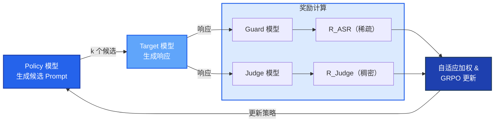
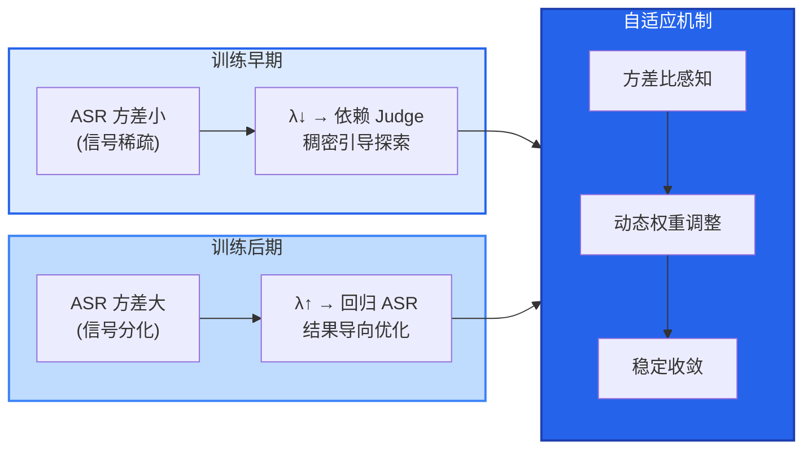

# 第一章 AHR-GRPO 主图设计

## 方案一：Mermaid 流程图（推荐，可导出为图片）

### 图 1：整体训练框架图（简化版）



### 图 2：自适应权重核心机制图

```mermaid
flowchart LR
    subgraph Step1["Step 1: 计算奖励方差"]
        direction TB
        A[组内奖励序列] --> B[计算均值]
        B --> C["计算方差<br/>σ²_ASR, σ²_Judge"]
    end

    subgraph Step2["Step 2: 方差比映射"]
        direction TB
        C --> D["ratio = σ²_ASR / σ²_Judge"]
        D --> E["λ_raw = sigmoid(α·log(ratio)+δ)"]
    end

    subgraph Step3["Step 3: 平滑与裁剪"]
        direction TB
        E --> F["EMA 平滑<br/>λ = β·λ_prev + (1-β)·λ_raw"]
        F --> G["边界裁剪<br/>λ ∈ [0.2, 0.8]"]
    end

    subgraph Step4["Step 4: 混合奖励"]
        direction TB
        G --> H["R_total = λ·R_ASR + (1-λ)·R_Judge"]
    end

    C --> D
    G --> H

    style Step1 fill:#dbeafe,stroke:#2563eb,stroke-width:2px
    style Step2 fill:#bfdbfe,stroke:#3b82f6,stroke-width:2px
    style Step3 fill:#93c5fd,stroke:#60a5fa,stroke-width:2px
    style Step4 fill:#2563eb,color:#fff,stroke:#1e40af,stroke-width:2px
```



### 图 3：物理直觉示意图



---

## 方案二：Python matplotlib 示意图（数据驱动）

### 图 4：Lambda 演化曲线示意图

```python
import matplotlib.pyplot as plt
import numpy as np

# 设置中文字体
plt.rcParams['font.sans-serif'] = ['SimHei', 'DejaVu Sans']
plt.rcParams['axes.unicode_minus'] = False

# 模拟 lambda 演化过程
steps = np.arange(1, 1001)

# 早期：lambda 较低（依赖 Judge）
early_lambda = 0.5 - 0.1 * np.sin(steps[:200] / 50) + 0.05 * np.random.randn(200)

# 中期：lambda 逐渐上升（ASR 信号分化）
mid_lambda = 0.4 + 0.0008 * (steps[200:500] - 200) + 0.03 * np.random.randn(300)

# 后期：lambda 稳定在较高值
late_lambda = 0.65 + 0.02 * np.random.randn(500)

lambda_curve = np.concatenate([early_lambda, mid_lambda, late_lambda])
lambda_curve = np.clip(lambda_curve, 0.2, 0.8)  # 边界裁剪

# 绘制 - 蓝色系配色
fig, ax = plt.subplots(figsize=(12, 6))

ax.plot(steps, lambda_curve, color='#2563eb', linewidth=2, label='λ (ASR 权重)')
ax.axhline(y=0.5, color='#64748b', linestyle='--', alpha=0.5, label='固定权重基线')

# 区域标注 - 蓝色系渐变
ax.axvspan(1, 200, alpha=0.2, color='#2563eb', label='早期探索')
ax.axvspan(200, 500, alpha=0.2, color='#3b82f6', label='中期过渡')
ax.axvspan(500, 1000, alpha=0.2, color='#60a5fa', label='后期优化')

ax.set_xlabel('训练步数', fontsize=14)
ax.set_ylabel('λ (ASR 权重)', fontsize=14)
ax.set_title('自适应奖励权重λ演化曲线', fontsize=16)
ax.legend(loc='upper right', fontsize=12)
ax.set_xlim(0, 1000)
ax.set_ylim(0, 1)

plt.tight_layout()
plt.savefig('lambda_evolution.png', dpi=300, bbox_inches='tight')
plt.show()
```

---

## 方案三：draw.io 手绘指南

### 推荐使用 draw.io 绘制的图类型：

1. **整体框架图**（图 1 类型）
   - 网址：https://app.diagrams.net/
   - 使用矩形框表示各模块
   - 使用箭头表示数据流
   - 添加配色区分不同功能模块

2. **核心机制示意图**（图 2 类型）
   - 使用圆形表示计算节点
   - 使用箭头表示流程
   - 添加公式标注

---

## 导出建议

| 目标格式 | Mermaid 导出方式 |
|----------|-----------------|
| **PNG** | 使用 mermaid-cli 或在线编辑器 |
| **SVG** | 使用 mermaid-cli 或 draw.io |
| **PDF** | SVG 转 PDF 或直接打印 |
| **Word 插入** | PNG 或 SVG 均可 |

### Mermaid 导出工具：
1. **在线编辑器**: https://mermaid.live/ （直接导出 PNG/SVG）
2. **VS Code 插件**: Mermaid Preview
3. **命令行工具**: `mmdc -i diagram.md -o diagram.png`

---

## 论文主图设计建议

### 第一章 AHR-GRPO 主图
- **主图类型**: 方法框架图 + Lambda 演化曲线
- **推荐组合**: 图 1（整体流程）+ 图 4（Lambda 演化）
- **核心展示**: 自适应权重机制的动态调整过程

### 第二章 SESS 主图
- **主图类型**: 三阶段流程图 + Skills 演化示意图
- **核心展示**: Skills 的提取、演化、维护机制

---

*文档生成日期：2026-06-15*
