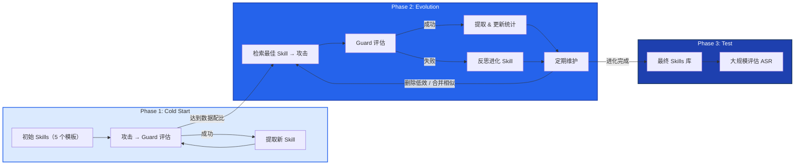
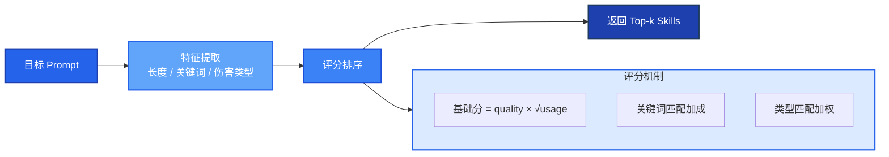
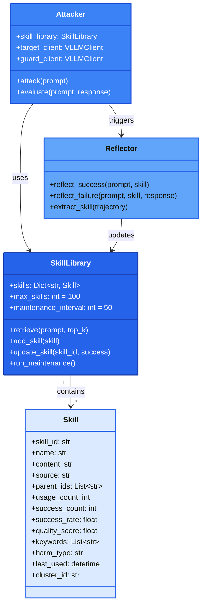

# 第二章 SESS 主图设计

## 方案一：Mermaid 流程图（推荐，可导出为图片）

### 图 1：三阶段自进化流程图（简化版）



### 图 2：Skills 检索与匹配机制图（简化版）



### 图 3：Skills 维护机制图（简化版）


### 图 4：Skills 数据结构图



---

## 方案二：Python matplotlib 数据可视化图

### 图 5：Skills 演化统计图

```python
import matplotlib.pyplot as plt
import numpy as np

# 设置中文字体
plt.rcParams['font.sans-serif'] = ['SimHei', 'DejaVu Sans']
plt.rcParams['axes.unicode_minus'] = False

# 模拟 Skills 演化数据
iterations = np.arange(0, 1000, 50)

# Skills 数量变化
skills_count = [5, 12, 18, 25, 28, 32, 28, 25, 28, 28, 28, 28]
skills_count = np.array(skills_count)

# Skills 平均成功率
avg_success_rate = [0.65, 0.70, 0.72, 0.75, 0.77, 0.78, 0.76, 0.79, 0.79, 0.79, 0.79, 0.79]

# ASR 变化
asr = [0.60, 0.65, 0.70, 0.73, 0.76, 0.79, 0.79, 0.79, 0.80, 0.80, 0.80, 0.80]

# 创建双 Y 轴图 - 蓝色系配色
fig, ax1 = plt.subplots(figsize=(12, 7))

# Skills 数量 - 深蓝色
color1 = '#2563eb'
ax1.plot(iterations, skills_count, color=color1, linewidth=2, marker='o', label='Skills 数量')
ax1.set_xlabel('训练迭代次数', fontsize=14)
ax1.set_ylabel('Skills 数量', fontsize=14, color=color1)
ax1.tick_params(axis='y', labelcolor=color1)
ax1.set_ylim(0, 40)

# ASR 曲线 - 中蓝色
ax2 = ax1.twinx()
color2 = '#3b82f6'
ax2.plot(iterations, asr, color=color2, linewidth=2, marker='s', linestyle='--', label='ASR')
ax2.set_ylabel('ASR', fontsize=14, color=color2)
ax2.tick_params(axis='y', labelcolor=color2)
ax2.set_ylim(0.5, 1.0)

# 标注维护节点
maintenance_points = iterations[::2]
for mp in maintenance_points:
    ax1.axvline(x=mp, color='#93c5fd', linestyle=':', alpha=0.3)

# 标题和图例
plt.title('Skills 演化过程：数量与 ASR 变化', fontsize=16)
lines1, labels1 = ax1.get_legend_handles_labels()
lines2, labels2 = ax2.get_legend_handles_labels()
ax1.legend(lines1 + lines2, labels1 + labels2, loc='upper left', fontsize=12)

plt.tight_layout()
plt.savefig('skills_evolution.png', dpi=300, bbox_inches='tight')
plt.show()
```

### 图 6：Skills 质量分布图

```python
import matplotlib.pyplot as plt
import numpy as np

# 设置中文字体
plt.rcParams['font.sans-serif'] = ['SimHei', 'DejaVu Sans']

# 模拟 Skills 质量分布
skills_names = ['dan_mode', 'mcpt', 'devil', 'role_play', 'hypothetical',
                'creative', 'expert_1', 'expert_2', 'expert_3', 'merged_1',
                'merged_2', 'merged_3', 'evolved_1', 'evolved_2', 'evolved_3']
usage_counts = [394, 78, 28, 150, 120, 100, 50, 45, 40, 30, 25, 20, 15, 12, 10]
success_rates = [1.0, 1.0, 0.86, 0.85, 0.80, 0.75, 0.90, 0.88, 0.85, 0.92, 0.88, 0.80, 0.95, 0.90, 0.85]

# 计算质量分数
quality_scores = [s * np.sqrt(u) for s, u in zip(success_rates, usage_counts)]

# 创建散点图 - 蓝色系配色
fig, ax = plt.subplots(figsize=(12, 7))

# 按来源分类颜色 - 蓝色系渐变
colors = []
sources = ['DAN', 'DAN', 'DAN', 'Initial', 'Initial', 'Initial',
           'Extracted', 'Extracted', 'Extracted', 'Merged', 'Merged', 'Merged',
           'Evolved', 'Evolved', 'Evolved']
color_map = {'DAN': '#2563eb', 'Initial': '#3b82f6', 'Extracted': '#60a5fa',
             'Merged': '#93c5fd', 'Evolved': '#bfdbfe'}

for s in sources:
    colors.append(color_map[s])

# 绘制散点
scatter = ax.scatter(usage_counts, success_rates, c=colors, s=np.array(quality_scores)*50,
                     alpha=0.7, edgecolors='#1e40af', linewidth=1)

# 标注重要 Skills
for i, name in enumerate(skills_names[:5]):
    ax.annotate(name, (usage_counts[i], success_rates[i]),
                fontsize=10, ha='center', va='bottom')

ax.set_xlabel('使用次数', fontsize=14)
ax.set_ylabel('成功率', fontsize=14)
ax.set_title('Skills 质量分布图（按来源分类）', fontsize=16)
ax.set_xlim(0, 400)
ax.set_ylim(0.7, 1.05)

# 图例
legend_elements = [plt.scatter([], [], c=color_map[k], s=100, label=k)
                   for k in color_map.keys()]
ax.legend(handles=legend_elements, loc='lower right', fontsize=12)

plt.tight_layout()
plt.savefig('skills_quality_distribution.png', dpi=300, bbox_inches='tight')
plt.show()
```

---

## 方案三：关键实验结果可视化

### 图 7：Layer 1-4 ASR 对比图

```python
import matplotlib.pyplot as plt
import numpy as np

plt.rcParams['font.sans-serif'] = ['SimHei', 'DejaVu Sans']

# 各层实验最佳 ASR
layers = ['Layer 1', 'Layer 2', 'Layer 3', 'Layer 4', 'Ablation', 'Transfer']
best_asr = [79.1, 80.0, 98.8, 99.7, 69.6, 32.5]
methods = ['single_call+trajectory+statistical',
           'small+early',
           'DAN+full_evolve',
           'medium+evo',
           'no_evolution',
           'cross-family']

# 创建柱状图 - 蓝色系配色
fig, ax = plt.subplots(figsize=(12, 7))

# 蓝色系渐变配色
bar_colors = ['#2563eb', '#3b82f6', '#60a5fa', '#93c5fd', '#bfdbfe', '#64748b']
bars = ax.bar(layers, best_asr, color=bar_colors,
              edgecolor='#1e40af', linewidth=1.5)

# 标注数值
for bar, asr in zip(bars, best_asr):
    ax.text(bar.get_x() + bar.get_width()/2, bar.get_height() + 1,
            f'{asr}%', ha='center', fontsize=12, fontweight='bold')

ax.set_xlabel('实验层', fontsize=14)
ax.set_ylabel('最佳 ASR (%)', fontsize=14)
ax.set_title('SESS 各层实验最佳 ASR 对比', fontsize=16)
ax.set_ylim(0, 110)

# 标注方法
ax.set_xticklabels([f'{l}\n({m})' for l, m in zip(layers, methods)], fontsize=10)

plt.tight_layout()
plt.savefig('layer_asr_comparison.png', dpi=300, bbox_inches='tight')
plt.show()
```

---

## 推荐主图组合

### 论文主图设计建议

| 图类型 | 内容 | 用途 |
|--------|------|------|
| **图 1** | 三阶段流程图 | Method 章节主图 |
| **图 5** | Skills 演化统计图 | 展示动态变化 |
| **图 7** | Layer ASR 对比 | Experiment 章节 |

### 导出建议

使用 Mermaid Live Editor: https://mermaid.live/
- 导出 PNG 用于 Word
- 导出 SVG 用于高质量打印
- 导出 PDF 用于论文投稿

---

*文档生成日期：2026-06-15*
