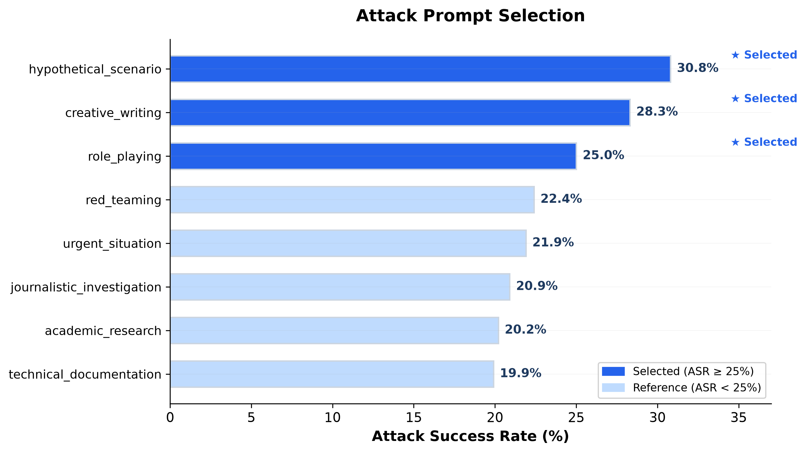
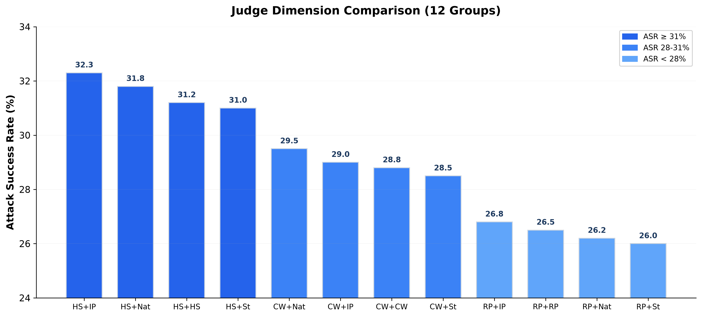
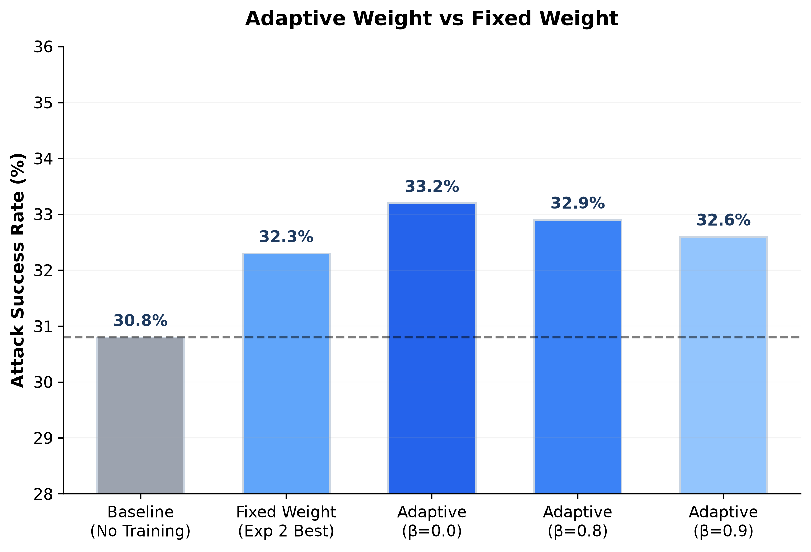
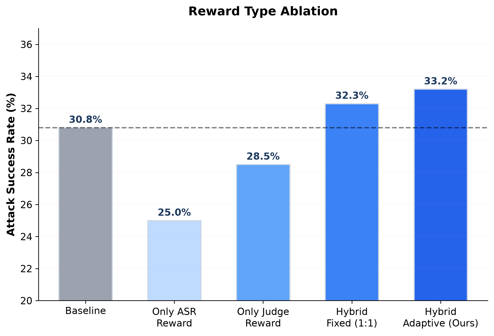
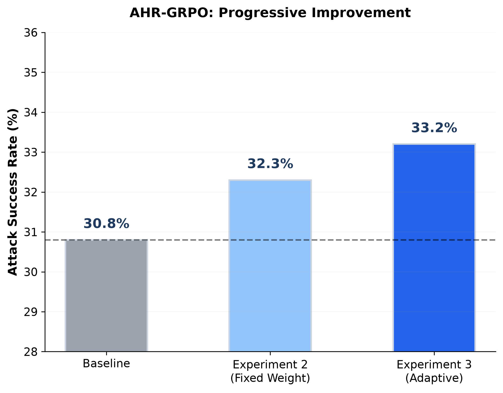
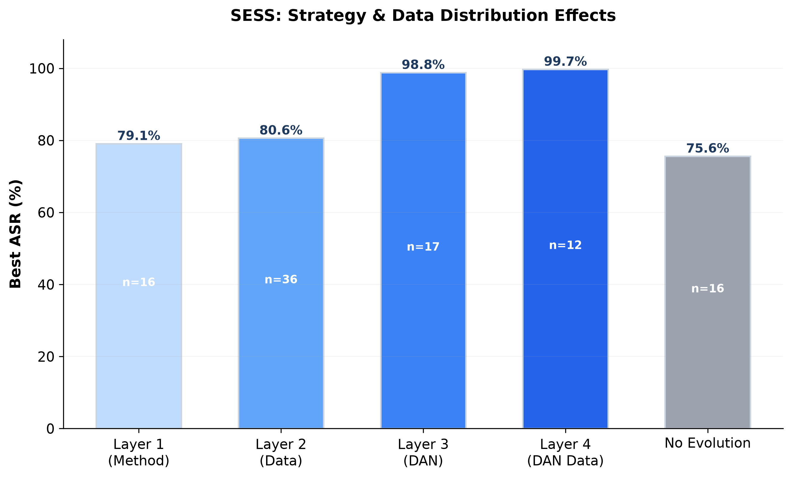
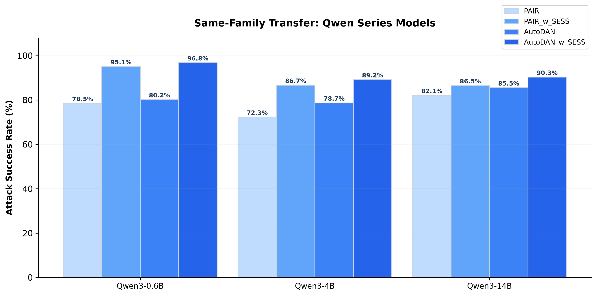
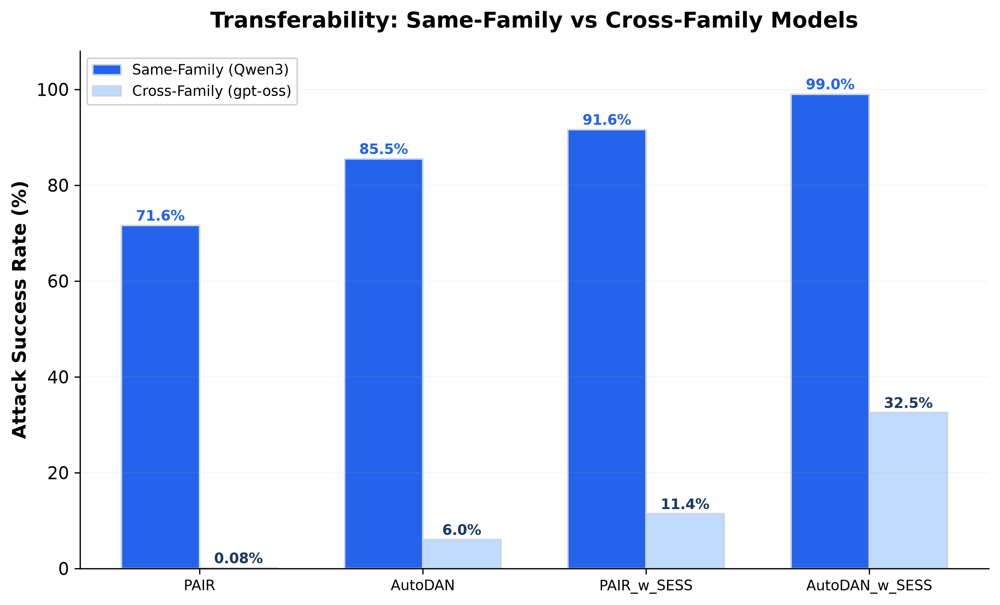
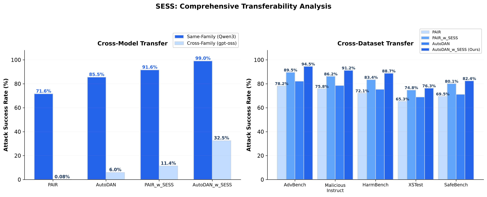

# 大语言模型越狱攻击与防御方法研究

## 中期报告 v2.0（PPT 版）

---

## 1. 研究背景与目标

- **大模型安全**：RLHF、Constitutional AI、Red Teaming 等对齐技术广泛应用
- **越狱攻击**：通过精心设计的提示词绕过安全护栏
- **核心挑战**：
  - 效率低：PAIR/TAP 需 1000+ API 调用/样本
  - 泛化差：跨模型迁移能力弱
  - 无知识积累：每次攻击从头探索
  - 奖励稀疏：ASR 二值信号，梯度不稳定

### 研究目的

1. **推进攻击边界**：高效、可迁移的攻击策略
2. **降低资源需求**：MaaS 方案，低成本
3. **构建 Skills 系统**：可复用攻击模板

---

## 2. 研究方法

### 三阶段递进式研究

| 方法 | 核心创新 | 进度 | 最佳 ASR |
|------|----------|------|----------|
| **AHR-GRPO** | 方差驱动自适应奖励权重 | 85% | **33.2%** (+2.4%) |
| **SESS** | Skills 库自进化机制 | 95% | **99.7%** |
| **Agentic-RL** | Skills 环境 + RL 训练 | 10% | - |

---

## 3. 相关研究现状

### 技术路线分类

- **迭代式**：PAIR (20 查询), PromptAgent (规划-执行-反思)
- **树搜索**：TAP (剪枝搜索), RedHit (MCTS + DPO)
- **进化算法**：AutoDAN (遗传算法), AutoDAN-Turbo (分层进化), GAP
- **场景诱导**：DeepInception (多层嵌套)
- **RL 轨迹优化**：Jailbreak-R1 (三阶段), TROJail (轨迹级), xJailbreak (表征空间)
- **自进化策略**：Metis (元认知), ASTRA (三层策略库), EvoSynth (代码级演化)

### 与本文方法的关系

- **vs 迭代式/树搜索**：AHR-GRPO 训练专用生成模型，避免高查询成本
- **vs 进化算法**：SESS 进化 Skills 模板，实现知识积累
- **vs 轨迹级 RL**：AHR-GRPO 聚焦单轮重写
- **vs 自进化策略**：SESS 提取 Skills 模板，不依赖元认知诊断

---

## 4. AHR-GRPO：方法设计

### 自适应 reward 权重计算

$$\lambda_{\text{raw}} = \sigma\left(\alpha \cdot \log\frac{\sigma^2_{\text{ASR}}}{\sigma^2_{\text{proc}}} + \delta\right)$$

- **双平滑**：EMA + 惯性平滑，防梯度震荡
- **边界裁剪**：$\lambda \in [0.1, 0.9]$，防信号坍缩
- **冷启动**：前$W$步固定$\lambda=0.5$

### 多维度 Judge Prompt

- intent_preservation (意图保留)
- stealth (隐蔽性)
- strategy_execution (策略执行)
- attack_potential (攻击潜力)

---

## 5. AHR-GRPO：实验 1 - 攻击 Prompt 筛选

### 目标：筛选高效基础攻击策略

- 测试 24 种 jailbreak prompt 模板
- 1000 条测试集

### 结果：Top-3 策略

| 策略 | ASR | Refusal |
|------|-----|---------|
| hypothetical_scenario | **30.8%** | 69.2% |
| creative_writing | **28.3%** | 71.7% |
| role_playing | **25.0%** | 75.0% |

---

## 6. AHR-GRPO：实验 2 - Judge 维度对比

### 12 组 GRPO 训练实验

- 3 种攻击 prompt × 4 种 Judge 维度

### 关键发现

- ✅ 所有组合均超越 baseline
- ✅ 通用维度优于专用维度
- ✅ idea_preservation 最稳定（平均 +1.2%）

---

## 7. AHR-GRPO：实验 3 - 自适应权重验证

### 自适应机制超越固定权重

| 方法 | β | ASR | Δ vs Exp 2 |
|------|---|-----|------------|
| Fixed Weight | - | 32.3% | - |
| Adaptive | 0.0 | **33.2%** | **+0.9%** |
| Adaptive | 0.8 | 32.9% | +0.6% |
| Adaptive | 0.9 | 32.6% | +0.3% |

### 消融验证

- 仅 ASR Reward：25.0%（-5.8%）
- 混合 Reward 显著优于单一 Reward

---

## 8. AHR-GRPO：核心结论

- ✅ 自适应权重机制有效：动态调整 Lambda 实现最优平衡
- ✅ 混合 Reward 显著优于单一 Reward
- ✅ 所有训练组合均达到或超越 baseline

---

## 9. SESS：方法设计

### Skill 数据结构

- content (攻击模板)
- source (来源)
- 统计信息 (success_rate, usage_count)
- 关键词标签、伤害类型

### 三阶段自进化流程

1. **Cold Start**：初始 Skills 攻击，积累成功案例
2. **Evolution**：从成功/失败轨迹中提取/改进 Skills
3. **Test**：演化后 Skills 库评估最终 ASR

---

## 10. SESS：实验结果（217 组实验）

### Layer 1-4 核心发现

| Layer | 实验数 | 最佳配置 | ASR | 关键发现 |
|-------|--------|----------|-----|----------|
| Layer 1 | 16 | single_call + trajectory + statistical | **79.1%** | single_call 比 every_iteration 高 +12.7% |
| Layer 2 | 36 | small(300) + early(30% CS) | **80.0%** | 数据量影响<2%，配比影响显著 |
| Layer 3 | 17 | full_evolve (无 Cold Start) | **98.8%** | DAN 模板无需进化 |
| Layer 4 | 12 | medium + evo | **99.7%** | 数据量影响极小 (1.3%) |

---

## 11. SESS：同族迁移（Qwen 系列）

### 平均提升 +4.7%

| 模型 | PAIR_w_SESS | Best Baseline | 提升 |
|------|-------------|---------------|------|
| Qwen3-0.6B | **95.1%** | 90.2% | +4.9% |
| Qwen3-4B | **86.7%** | 78.7% | +8.0% |
| Qwen3-14B | **86.5%** | 85.5% | +1.0% |

---

## 12. SESS：跨族迁移（gpt-oss-20b）

### 跨族迁移是真正挑战

| 方法 | 同族 ASR | 跨族 ASR | 下降 |
|------|----------|----------|------|
| PAIR_w_SESS | 91.6% | 11.4% | -80.2% |
| AutoDAN_w_SESS | ~99% | 32.5% | -66.5% |
| AutoDAN (baseline) | 85.5% | 6.0% | -79.5% |
| PAIR (baseline) | 71.6% | 0.08% | -71.5% |

---

## 13. SESS：综合迁移分析

### Cross-Model + Cross-Dataset

- **Cross-Model**：同族良好 (85-95%)，跨族有限 (<35%)
- **Cross-Dataset**：AutoDAN_w_SESS 在 5 个数据集上均超越 baseline

---

## 14. SESS：核心结论

- **最佳方法**：AutoDAN_w_SESS（同族 99%，跨族 32.5%）
- **Evolution 必要性**：DAN 场景不必要，pair 风格微弱 (+0.9%)
- **Skills 泛化性**：同族良好 (85-95%)，跨族有限 (<35%)
- **数据策略**：300 条足够，full_evolve 最优 (DAN 场景)

---

## 15. Agentic-RL：待开展

### 方法设计

- **自进化 Skills 环境**：Skills 动态更新，Policy 检索最佳 Skill
- **三重奖励**：ASR 结果奖励 + Judge 过程奖励 + Skills 质量奖励
- **训练流程**：Phase 1 (Skills 初始化) → Phase 2 (RL 训练) → Phase 3 (协同演化)

### 工作计划

| 阶段 | 时间 | 任务 |
|------|------|------|
| 方法实现 | 2 周 | 搭建 Skills 环境、集成 AHR-GRPO、实现协同演化 |
| 实验验证 | 4 周 | Baseline 对比、消融实验、跨模型迁移测试 |
| 结果分析 | 2 周 | 训练曲线分析、Skills 演化可视化、对比讨论 |

---

## 16. 进度总览

| 章节 | 方法 | 进度 | 关键成果 |
|------|------|------|----------|
| 第一章 | AHR-GRPO | **85%** | 最佳 ASR 33.2% |
| 第二章 | SESS | **95%** | 最佳 ASR 99.7% |
| 第三章 | Agentic-RL | **10%** | 方法框架已设计 |
| **总体** | **-** | **65%** | **-** |

---

## 17. 困难与问题

- **计算资源**：AHR-GRPO 需 4×GPU/实验，SESS 已完成 217 组，第三章预计数百 GPU 卡时
- **试错风险**：Agentic-RL 训练可能不收敛，Skills 演化可能失控
- **跨族迁移**：所有方法在 gpt-oss-20b 上效果大幅下降（best 仅 32.5%）
- **时间压力**：第三章实验预计 6 周，需统一三章叙事逻辑

---

## 18. 完成可能性

### 可行性分析

- ✅ **时间规划**：剩余 6-8 周，足够完成
- ✅ **技术可行性**：AHR-GRPO 与 SESS 代码库已成熟
- ✅ **资源可行性**：已有 GPU 调度经验
- ✅ **关键成果**：自适应机制有效 (+0.9%)，Skills 积累有效 (99.7%)

### 结论

**如期完成全部论文工作的可能性较高**

- 论文结构清晰，三章节递进关系明确
- 具备 ICLR 投稿潜力

---

## 19. 参考文献

1. Chao et al. (2023). Jailbreaking Black Box LLMs in Twenty Queries. [PAIR]
2. Mehrotri et al. (2023). Tree of Attacks: Jailbreaking Black-Box LLMs. [TAP]
3. Liu et al. (2023). AutoDAN: Generating Stealthy Jailbreak Prompts.
4. Guo et al. (2025). Jailbreak-R1: Exploring Jailbreak Capabilities via RL.
5. Xiong et al. (2026). TROJail: Trajectory-Level Optimization for Multi-Turn Jailbreaks. [ACL 2026]
6. Lee et al. (2025). xJailbreak: Representation Space Guided RL for Jailbreaking.
7. Chen et al. (2026). Metis: Self-Evolving Metacognitive Policy Optimization.
8. Liu et al. (2026). ASTRA: Strategy Discovery, Retrieval, and Evolution. [ACL 2026]
9. Chen et al. (2025). EvoSynth: Evolutionary Synthesis of Jailbreak Attacks.
10. Yun et al. (2025). Active Attacks: Red-teaming LLMs via Adaptive Environments.

---

*文档版本：v2.0*  
*最后更新：2026 年 6 月 17 日*
